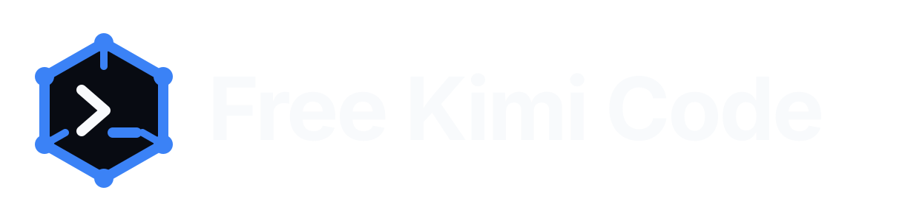

<div align="center">
  

  <br>
  <br>

  [](https://www.npmjs.com/package/@blizps/lazy-developer)
  [](https://github.com/BlizPS/free-kimi-code/actions/workflows/ci.yml)
  [](LICENSE)
  [](#-installation)

  <p>
    <strong>One portable developer layer for Kimi Code, Codex, and Antigravity.</strong><br>
    <em>Keep the native CLI experience. Share skills, routing, context controls, MCP, artifacts, and developer tooling.</em>
  </p>
</div>

---

[Installation](#-installation) · [Features](#-features) · [Commands](#commands) · [Integrations](#-integrations) · [Contributing](#-contributing)

# Free Kimi Code

**Free Kimi Code** is a free, open-source developer layer for **Kimi Code**, **Codex CLI**, and **Antigravity CLI**. It keeps their native interfaces while Lazy Developer provides the shared coding layer underneath.

```text
Kimi Code · Codex · Antigravity
        │
        ├── Portable AI skills
        ├── Live model routing
        ├── Context + token optimization
        ├── MCP search / browser tools
        ├── Safe artifact handling
        ├── Developer intelligence
        └── Native session compatibility
```

> Free Kimi Code is free software. Upstream model/provider availability, limits, authentication, and pricing are controlled by their respective services.

## ✨ Features

### 🧠 Portable AI Skills

Four focused skills are bundled:

- `lazy-developer` — implementation and engineering workflow
- `lazy-debug` — debugging and diagnosis
- `lazy-review` — code review and change analysis
- `lazy-test` — testing and verification

The same skills can be used by compatible agent and plugin environments.

### ⚡ Live Provider & Model Routing

Run:

```sh
lazydev setup
```

The setup flow shows the providers and models currently available to your installation. The list is intentionally dynamic, so this README does not hard-code a provider catalog.

### 🎯 Model-Aware Tools + Thinking

LazyDev checks route capabilities and preserves the selected model when possible. Models without native tool calling can use compatible local synthetic tool handling, while reasoning/thinking metadata is kept where supported.

### 🪶 Context Efficiency

Long coding sessions can accumulate tool output, history, logs, and intermediate results. LazyDev uses token budgets, rolling output pruning, relevance-aware retrieval, virtual context, and session compaction to keep useful context available without pretending the model has a smaller hard limit.

### ⚡ RTK Terminal Output

Supported shell output can be filtered through [RTK](https://github.com/rtk-ai/rtk) before reaching the model, reducing repetitive terminal noise and context usage.

### 🌐 Search, Browser & MCP

The bundled `lazydev-search` layer provides search/browser recovery, Unicode-safe output, focused reads, argument validation, and filesystem-safe boundaries. A separate developer MCP path is available for project tooling.

### 📁 Safe Artifacts

Standalone generated files use the canonical `lazydevfile` workspace and are create-only. Existing artifacts are preserved, while native client sessions and configuration stay in their normal locations.

### 🎨 UI, 3D, SEO & Language Intelligence

`lazydev ui <brief>` can generate a searchable design system before implementation. Research gates support current design/3D/SEO workflows, and `lazydev lang` exposes language-aware coding contracts such as TypeScript and Go.

### 🛡️ Guarded Developer Workflow

Filesystem, shell, prompt/context, artifact, proxy, and native configuration boundaries are checked before unsafe operations are accepted.

## 📦 Installation

### macOS / Linux / Termux Linux

```sh
curl -fsSL "https://raw.githubusercontent.com/BlizPS/free-kimi-code/main/install.sh" | sh
```

### Windows PowerShell

```powershell
& ([scriptblock]::Create((irm "https://raw.githubusercontent.com/BlizPS/free-kimi-code/main/install.ps1")))
```

The installer updates the shared LazyDev layer and the native AI CLI choices you select. Provider/model configuration stays separate.

```sh
lazydev setup
lazydev chat
```

### Universal Skills

```sh
npx skills add BlizPS/free-kimi-code --all
```

## 🚀 Quick Start

```sh
lazydev setup
lazydev chat
lazydev doctor
lazydev version
```

When several native coding CLIs are installed, `lazydev chat` detects the available UI and opens the selected workflow without replacing the native terminal interface.

## Commands

```text
lazydev help              Show command help
lazydev setup             Configure the available provider/model route
lazydev chat              Open the native coding UI
lazydev resume            Resume a saved native chat
lazydev skills            Browse bundled LazyDev skills
lazydev artifact <name>   Work with a standalone artifact path
lazydev env               Inspect the runtime environment
lazydev universal         Show universal integration details
lazydev ui <brief>        Generate a searchable design system
lazydev lang              Detect the active language contract
lazydev doctor            Check installation and configuration
lazydev version           Show the installed version
```

## 🖥️ Native CLI Integrations

**Kimi Code**, **Codex CLI**, and **Antigravity CLI** keep ownership of their native UI, authentication, sessions, and configuration. Lazy Developer provides the shared routing, context/token layer, skills, MCP, artifact policy, and installation discovery.

The same skill/runtime assets can also integrate with compatible environments such as Claude-compatible tools, OpenCode, OpenClaw, Cursor, Kiro, Qoder, Devin, and Grok.

### Resume

```sh
lazydev resume
```

LazyDev uses each client's native resume flow instead of inventing a separate session format.

## 🔄 Updating

Re-run the matching installer, then verify:

```sh
lazydev version
lazydev doctor
```

Managed executable discovery lives outside the replaceable LazyDev runtime, so normal updates preserve native client data and persistent integrations.

## 🐢 Termux / Android

For Linux-native AI CLI binaries on Termux, use a glibc Linux guest such as Debian or Ubuntu under `proot-distro`:

```sh
pkg update
pkg install proot-distro
proot-distro install debian
proot-distro login debian
```

Then run the normal installer inside the Linux guest.

## 🧪 Verification

The repository includes smoke tests and evaluations covering skills, providers, MCP, artifacts, filesystem guards, context handling, sessions, proxies, authentication, installers, efficiency, language detection, and plugin manifests.

```sh
npm test
```

## 🛡️ Safe by Default

- Standalone artifacts never overwrite existing files.
- Native client sessions stay in their native locations.
- Provider/model selection is explicit through `lazydev setup`.
- API keys, OAuth tokens, and provider credentials should never be committed.
- Reinstalling LazyDev is designed to preserve native client data.

See [SECURITY.md](SECURITY.md).

## 📚 Project Docs

[Getting Started](docs/getting-started.md) · [Provider & Model Routing](docs/provider-routing.md) · [ARCHITECTURE.md](ARCHITECTURE.md) · [COMPATIBILITY.md](COMPATIBILITY.md) · [CONTRIBUTING.md](CONTRIBUTING.md) · [SUPPORT.md](SUPPORT.md) · [AGENTS.md](AGENTS.md)

## ❓ FAQ

**What is Free Kimi Code?**  
A free, open-source Lazy Developer layer that works with Kimi Code, Codex CLI, and Antigravity CLI.

**How do I see available providers and models?**  
Run `lazydev setup`. The catalog is intentionally dynamic and may change over time.

**Does it replace Kimi Code, Codex, or Antigravity?**  
No. Their native CLI interfaces and session systems remain in charge.

**Does Free Kimi Code make every upstream model free?**  
No. It is free/open-source software; upstream model access and limits depend on the configured service.

## 🗑️ Uninstall

### macOS / Linux / Termux Linux

```sh
curl -fsSL "https://raw.githubusercontent.com/BlizPS/free-kimi-code/main/uninstall.sh" | sh
```

### Windows PowerShell

```powershell
& ([scriptblock]::Create((irm "https://raw.githubusercontent.com/BlizPS/free-kimi-code/main/uninstall.ps1")))
```

The uninstallers remove LazyDev-managed files while preserving supported native client data and RTK user data.

## 🤝 Contributing

Bug reports, provider compatibility reports, documentation fixes, skills, and integration improvements are welcome.

Use [Issues](https://github.com/BlizPS/free-kimi-code/issues) for concrete bugs and feature requests, [Discussions](https://github.com/BlizPS/free-kimi-code/discussions) for ideas and questions, and [CONTRIBUTING.md](CONTRIBUTING.md) for the contribution workflow.

If Free Kimi Code is useful to you, a star helps other developers discover the project.

## License

MIT. See [LICENSE](LICENSE).

<div align="center">
  <sub>Built by <strong>BlizPS</strong> · Free Kimi Code 1.0.2 · Lazy Developer · Kimi Code + Codex + Antigravity</sub>
</div>
