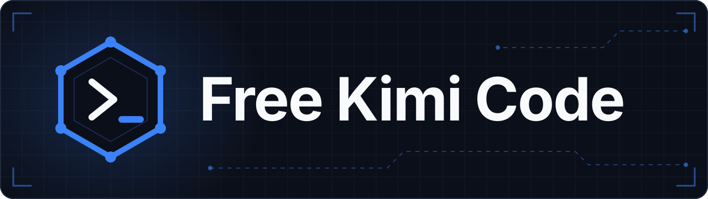

<div align="center">
  

  <br>
  <br>

  [](https://github.com/BlizPS/free-kimi-code)
  [](LICENSE)
  [](#-installation)
  [](https://github.com/BlizPS/free-kimi-code/stargazers)

  <p>
    <a href="https://github.com/BlizPS/free-kimi-code/issues">Issues</a> ·
    <a href="https://github.com/BlizPS/free-kimi-code/discussions">Discussions</a>
  </p>

  <p>
    <strong>Supercharge Kimi Code, Codex, and Antigravity with one portable LazyDev skill + routing layer.</strong><br>
    <em>Keep the familiar Kimi Code workflow while adding a stronger, cleaner developer experience.</em>
  </p>
</div>

---

## What is Lazy Developer?

**Lazy Developer** is a free, open-source toolkit that keeps **Kimi Code**, **Codex**, and **Antigravity** as your UI surfaces, while sharing **one** setup, model selection, proxy/routing layer, token/context optimization, and the bundled **LazyDev Skills**.

---

## Why Lazy Developer?

Kimi Code already provides the agent workflow. Lazy Developer focuses on the layer **around** it:

```text
Kimi Code · Codex · Antigravity
   │
   ├── Portable AI Skills
   ├── Live Provider / Model Discovery
   ├── Model-Aware Tools
   ├── Context Protection
   ├── Safer Artifacts
   ├── Search / Browser Resilience
   └── Cleaner Terminal Output
```

The goal is to keep the familiar agent experience while making longer, tool-heavy coding sessions easier to manage.

---

## Kimi Code · Codex · Antigravity

Lazy Developer keeps the native **Kimi Code, Codex, and Antigravity** CLI UIs and unifies the layer underneath them.

| | What happens |
| --- | --- |
| **Pick your UI** | Install whichever UIs you want. |
| **`lazydev chat`** | Opens the only installed UI automatically, or asks you to pick when several are installed. |
| **Provider & model** | Always comes from `lazydev setup`. |
| **Shared layer** | Same proxy, context/token layer, MCP server, and LazyDev Skills across all three surfaces. |

<p align="center">
  
</p>

<p align="center">
  <sub>Example Kimi Code workflow from the official <a href="https://github.com/MoonshotAI/kimi-code">MoonshotAI/kimi-code</a> repository</sub>
</p>

---

## ✨ What You Get

### 🧠 Portable AI Skills

Focused skills ship with the project for **implementation, debugging, review, testing**, and reusable engineering workflows.

They are packaged so compatible agent/plugin environments can use the same skill collection independently.

### ⚡ Live Provider & Model Discovery

Run:

```sh
lazydev setup
```

Lazy Developer can discover provider and model information from **live catalogs** where supported, instead of relying on one permanently hard-coded model roster.

Use `lazydev setup` to inspect the providers, models, credentials, and capabilities available on your current installation.

### 🔌 Model-Aware Tool Handling

- When a selected model supports **native tool calling**, Lazy Developer uses it directly.
- When native tool calling is unavailable on the selected route, the runtime can use a compatible **synthetic tool protocol** with the **same model** instead of silently switching to another one.

Tool behavior is based on **model capability**, not one fixed model ID.

### 🪶 Context Optimization

Long coding sessions can accumulate large amounts of tool output and archived history. Lazy Developer keeps the active context useful with:

- Token budgeting
- Rolling tool-output pruning
- Relevance-aware archive/retrieval
- Proactive context protection
- Preservation of useful code, paths, commands, errors, URLs, decisions, and evidence

> The runtime does not pretend the model has a smaller fixed context window. It focuses on using the available context **more efficiently**.

### ⚡ RTK-Powered Terminal Output

**Rust Token Killer (RTK)** is integrated for supported shell commands, so unnecessary terminal output is reduced *before* it reaches the model.

Terminal-heavy sessions stay lighter on tokens and context.

### 🧠 Thinking Compatibility

Provider and model metadata are respected for reasoning/thinking behavior where supported.

Model-specific capabilities are preserved without forcing one generic runtime setting onto every route.

### 🛡️ Context & Session Safety

Lazy Developer separates **active request context** from **archived history and tool output**. It keeps existing sessions usable across normal provider/model changes, and avoids blindly injecting unrelated archived content into every request.

### 📁 Safe Artifacts

Standalone artifacts use the canonical `lazydevfile` directory and **never overwrite existing files**.

- Official CLI application data stays in each CLI's normal user-home location.
- `lazydevfile` is the visible shared workspace/artifact root.
- Termux/PRoot is the only storage exception for visible artifacts.

Collisions receive the lowest available numeric suffix:

```text
report.html
report1.html
report2.html
```

### 🌐 Search & Browser Resilience

Search, browser, and file operations include validation and recovery checks for common malformed tool arguments.

Large outputs are handled without blindly filling the active context.

---

## 📦 Installation

### macOS / Linux

During installation, LazyDev asks separately whether to install/update **Kimi Code**, **Codex**, and **Antigravity**. The official CLIs are used; LazyDev keeps the setup, model, proxy/routing, context optimization, and skills layer shared.

```sh
curl -fsSL "https://raw.githubusercontent.com/BlizPS/free-kimi-code/main/install.sh" | sh
```

### Windows PowerShell

```powershell
& ([scriptblock]::Create((irm "https://raw.githubusercontent.com/BlizPS/free-kimi-code/main/install.ps1")))
```

Then:

```sh
lazydev setup
lazydev chat
```

### Universal Skills

The bundled skills can also be installed independently for compatible agent CLIs:

```sh
npx skills add BlizPS/free-kimi-code --all
```

---

## 🚀 Quick Start

After installation, follow these steps.

**1. Set up** and inspect the available providers and models:

```sh
lazydev setup
```

**2. Start** a coding session:

```sh
lazydev chat
```

**3. Check** the installation:

```sh
lazydev doctor
```

Show the installed version:

```sh
lazydev version
```

---

## 🧩 Skills & Plugin Support

Lazy Developer is designed so its skills can be used **beyond the main CLI** in compatible agent and plugin environments.

The repository includes reusable skill assets and compatibility-oriented project integrations for:

- Kimi Code
- Codex CLI
- Antigravity CLI
- Claude-compatible plugin environments
- OpenCode
- OpenClaw
- Cursor
- Other compatible skill/plugin runtimes

> Compatibility can vary by environment and feature.

---

## 🧰 Useful Commands

```text
lazydev help
lazydev setup
lazydev chat
lazydev sessions
lazydev skills
lazydev artifact <filename>
lazydev env
lazydev doctor
lazydev version
```

---

## 🔄 Updating

Re-run the matching installer, then verify:

```sh
lazydev version
lazydev doctor
```

---

## 🐢 Termux / Android

Kimi Code's Linux binary requires a **glibc-based** Linux userland.

On Termux, use a Debian or Ubuntu guest:

```sh
pkg update
pkg install proot-distro

proot-distro install debian
proot-distro login debian
```

Then run the normal Lazy Developer installer inside the guest.

---

## 🛡️ Safe by Default

- Standalone artifacts never overwrite existing files.
- Saved sessions stay in place during normal model switching.
- Strict proxy routes can repair incomplete tool-call history.
- Never commit API keys, OAuth tokens, or provider credentials.

---

## 🤝 Contributing

Bug reports, feature requests, documentation improvements, and compatible skill contributions are all welcome. ❤️

Use [GitHub Issues](https://github.com/BlizPS/free-kimi-code/issues) and [Discussions](https://github.com/BlizPS/free-kimi-code/discussions) for project feedback, compatibility reports, ideas, and community support.

If you find Lazy Developer useful, consider starring the repository.

---

## 📄 License

MIT. See [LICENSE](LICENSE)

<div align="center">
  <sub>Built by <strong>BlizPS</strong> · Lazy Developer 1.0.2 · Kimi Code + Codex + Antigravity</sub>
</div>
